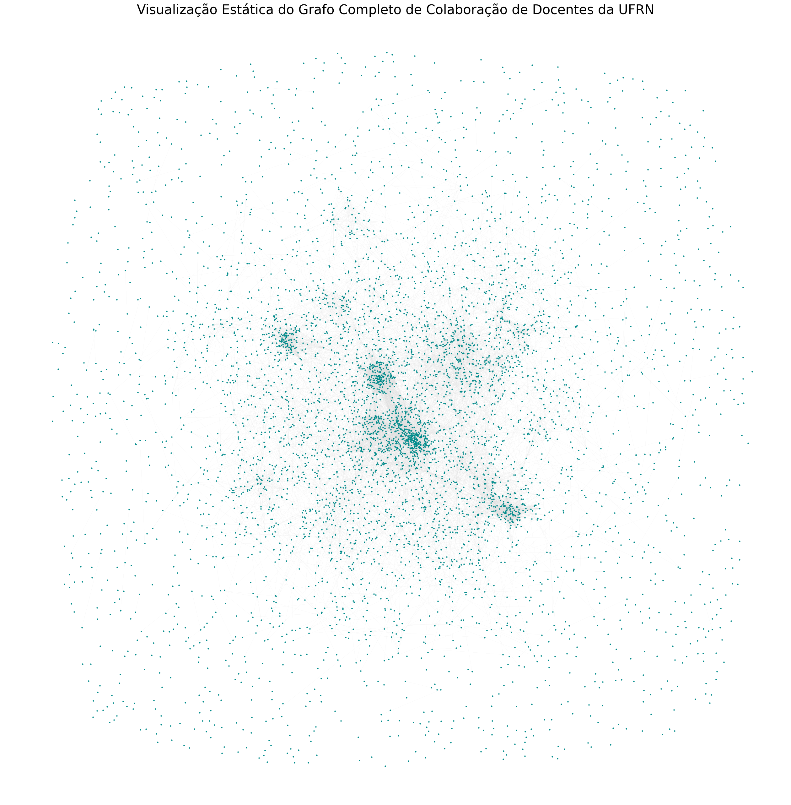
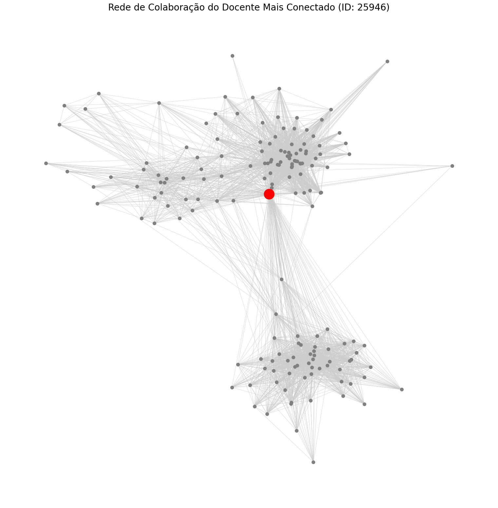
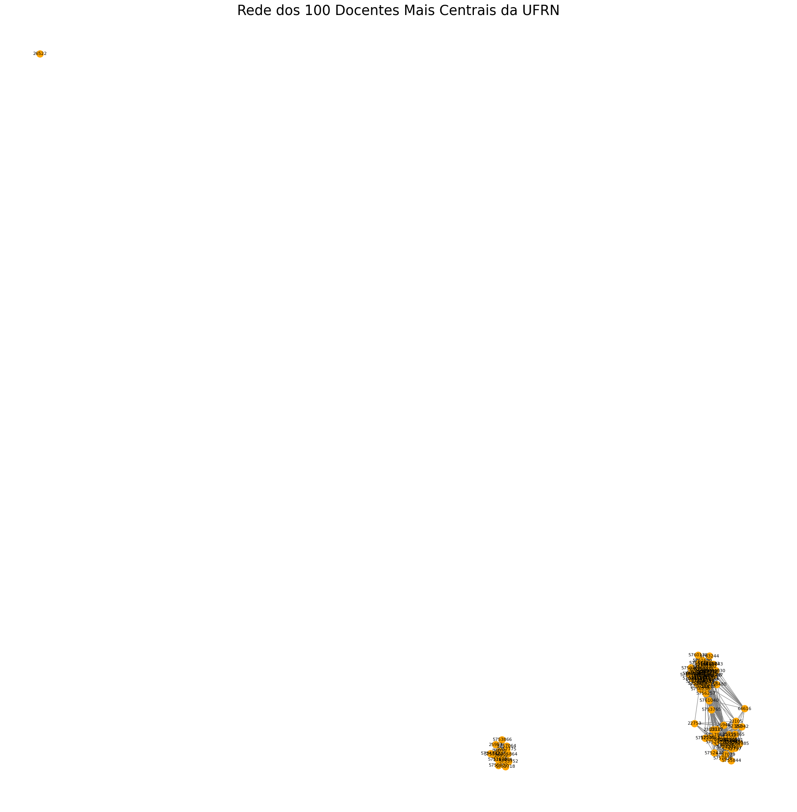
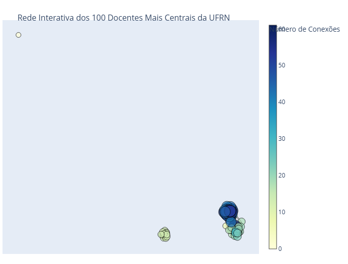
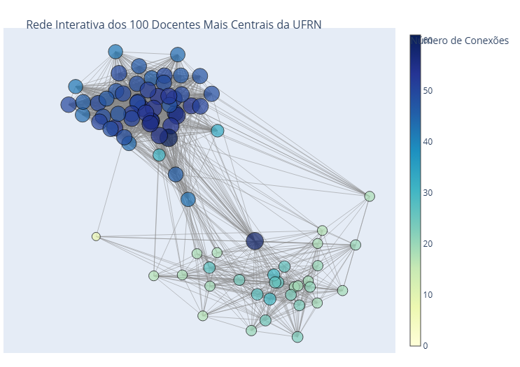
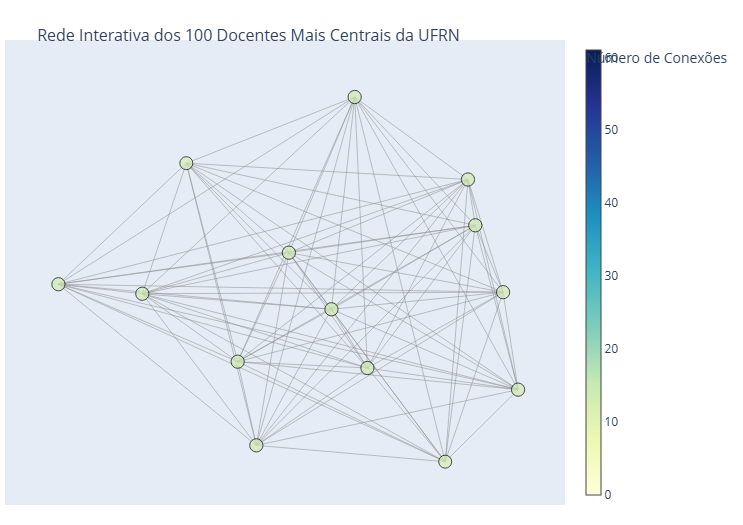
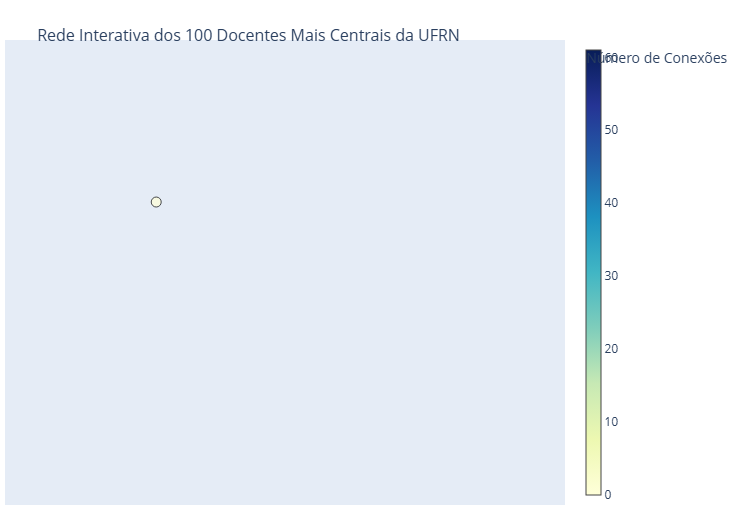

**O projeto foi desenvolvido por Ariadne Silva e Arthur Queiroz**  
**DCA3702 – Algoritmos e Estruturas de Dados II**

# Projeto 1: Modelagem e Análise de Grafos  
**Aplicação de grafos em problemas reais**

---

## 1. Coleta e Preparação dos Dados

<p align = "justify">Como parte das instruções do trabalho, utilizamos a plataforma de <b>dados abertos da UFRN</b> para coletar informações sobre a avaliação dos docentes, disponibilizadas em um arquivo `.csv`.</p>

<p align = "justify">O ambiente escolhido para o processamento foi o <b>Google Colab</b>, onde importamos o arquivo <b>avaliacaodocencia.csv</b>. Partindo do uso da bibliotecas pandas e o arquivo <b>.csv</b>, iniciamos o tratamento dos dados, realizando:</p>

- Análise das cinco primeiras linhas do conjunto
- Verificação dos nomes e tipos das colunas
- Avaliação da consistência e padronização dos dados

<p align = "justify">Identificamos que o arquivo contém <b>12 colunas bem definidas</b>, entre elas:</p>

- `id_docente`
- `nome_docente`
- `id_turma`

<p align = "justify">Essas colunas serão fundamentais para a construção da rede de análise baseada em grafos.</p>
<p align = "justify">Além disso, outras bibliotecas também foram usadas na criação do Grafo, são elas:.</p>

- `networkx`
- `matplotlib.pyplot`
- `itertools`
- `plotly.graph_object`

### Resultado do tratamento de dados:

```
Primeiras 5 linhas do arquivo:
   id_docente               nome_docente  id_turma   ano  periodo  \
0       15370  FERNANDO MOREIRA DA SILVA   1209923  2013        2   
1       15370  FERNANDO MOREIRA DA SILVA   1222008  2014        1   
2       15370  FERNANDO MOREIRA DA SILVA   1222218  2014        1   
3       15370  FERNANDO MOREIRA DA SILVA   1229520  2014        2   
4       15370  FERNANDO MOREIRA DA SILVA   1229545  2014        2   

   qtd_discentes  postura_profissional_media  postura_profissional_DP  \
0             14                        9.17                     1.34   
1             15                        9.44                     0.92   
2             38                        9.19                     1.67   
3             13                        9.06                     1.16   
4             24                        9.27                     1.28   

   atuacao_profissional_media  atuacao_profissional_DP  \
0                        8.13                     2.70   
1                        7.17                     3.08   
2                        6.77                     3.29   
3                        7.68                     2.51   
4                        8.45                     1.72   

   autoavaliacao_aluno_media  autoavaliacao_aluno_DP  
0                       7.61                    2.53  
1                       8.71                    1.72  
2                       8.12                    2.53  
3                       7.62                    2.77  
4                       8.48                    1.86  
```

```
Informações sobre as colunas:
<class 'pandas.core.frame.DataFrame'>
RangeIndex: 179089 entries, 0 to 179088
Data columns (total 12 columns):
 #   Column                      Non-Null Count   Dtype  
---  ------                      --------------   -----  
 0   id_docente                  179089 non-null  int64  
 1   nome_docente                179089 non-null  object 
 2   id_turma                    179089 non-null  int64  
 3   ano                         179089 non-null  int64  
 4   periodo                     179089 non-null  int64  
 5   qtd_discentes               179089 non-null  int64  
 6   postura_profissional_media  179089 non-null  float64
 7   postura_profissional_DP     179089 non-null  float64
 8   atuacao_profissional_media  179089 non-null  float64
 9   atuacao_profissional_DP     179089 non-null  float64
 10  autoavaliacao_aluno_media   103626 non-null  float64
 11  autoavaliacao_aluno_DP      103626 non-null  float64
dtypes: float64(6), int64(5), object(1)
memory usage: 16.4+ MB
```

```
Nomes das colunas:
Index(['id_docente', 'nome_docente', 'id_turma', 'ano', 'periodo',
       'qtd_discentes', 'postura_profissional_media',
       'postura_profissional_DP', 'atuacao_profissional_media',
       'atuacao_profissional_DP', 'autoavaliacao_aluno_media',
       'autoavaliacao_aluno_DP'],
      dtype='object')
```

---

## 2. Definição do Problema

<p align = "justify">Com base nos dados analisados, formulamos o seguinte problema:</p>

> **Como os docentes da UFRN se conectam através da coocorrência em turmas?**  
> **É possível identificar uma rede de colaboração com base nos docentes que lecionam para as mesmas turmas?**

<p align = "justify">Para responder a essas perguntas, utilizaremos as colunas:</p>

- `id_docente`
- `nome_docente`
- `id_turma`

---

## 3. Modelagem da Rede

### Estrutura Escolhida: Grafo de Coocorrência

<p align = "justify">A estrutura mais adequada para representar esse problema é um <b>Grafo de Coocorrência</b>, definido da seguinte forma:</p>  

- **Nós (Vértices):**  
  Cada nó representa um docente único, identificado pela coluna `id_docente`.

- **Arestas (Ligações):**  
  Uma aresta será criada entre dois docentes sempre que ambos tiverem lecionado na mesma turma (`id_turma`). Essa ligação representa uma colaboração ou interface de trabalho comum.

### Grafo Ponderado

Para enriquecer a análise, utilizamos um **grafo ponderado**, atribuindo pesos às arestas com base em critérios relevantes:

- **Frequência de Colaboração:**  
  O peso da aresta será o número de turmas compartilhadas entre dois docentes. Arestas com maior peso indicam colaborações mais frequentes.

- **Qualidade da Atuação (alternativa):**  
  Outra possibilidade seria utilizar a média da `atuacao_profissional_media` dos docentes nas turmas compartilhadas. No entanto, nesta etapa, adotamos a **frequência de colaboração** como métrica principal por ser mais direta e eficaz.

  ### Resumo
| **Tópico do Projeto** | **Nossa Definição para o Projeto** | **Colunas dos Dados Utilizadas** |
|------------------------|-------------------------------------|-----------------------------------|
| **Problema Real**      | Analisar a rede de colaboração de docentes da UFRN baseada na coocorrência em turmas. | id_docente, id_turma |
| **Tipo de Grafo**      | Grafo de Coocorrência, Não-Direcionado e Ponderado | id_docente, id_turma |
| **Nós**                | Cada id_docente único | id_docente, nome_docente |
| **Arestas**            | Uma ligação entre dois docentes que lecionaram para a mesma id_turma | id_docente, id_turma |
| **Peso da Aresta**     | O número de turmas que os dois docentes compartilharam. | id_turma (contagem) |

---

## 4. Aplicações Estratégicas da Rede de Colaboração

<p align = "justify">A análise da rede de colaboração entre docentes possui aplicações relevantes em diversos contextos institucionais:</p>  

### 4.1 Gestão Acadêmica e Alocação de Recursos

- Identificação de docentes "hubs" para disseminar práticas pedagógicas
- Liderança em reformas curriculares
- Mentoria para novos professores
- Criação de políticas de incentivo à colaboração interdisciplinar

### 4.2 Mapeamento de Comunidades de Prática

- Identificação de clusters coesos e isolados
- Avaliação da integração entre departamentos e campi
- Planejamento de investimentos em infraestrutura colaborativa

### 4.3 Análise de Resiliência da Rede Acadêmica

- Identificação de vulnerabilidades estruturais
- Planejamento de sucessão para docentes centrais
- Programas de distribuição de conhecimento para maior resiliência institucional

### 4.4 Desenvolvimento Profissional dos Docentes

- **Onboarding de Novos Professores:**  
  Facilita a integração de docentes recém-contratados ao identificar parceiros estratégicos.

- **Oportunidades de Pesquisa e Ensino:**  
  Revela parcerias ocultas e potenciais disciplinas interdepartamentais, como a criação de uma disciplina de **Bioestatística** entre Estatística e Biologia.

---

## 5. Construção do Grafo a partir da Base de Dados 

<p align = "justify">Nesta etapa, implementamos em Python — utilizando a biblioteca `networkx` — a estrutura de grafo ponderado que representa nossa rede. Os **nós** correspondem aos **docentes**, enquanto as **arestas** indicam a **coocorrência desses docentes em turmas compartilhadas**. Essa transformação permite representar os dados de forma relacional, viabilizando análises mais profundas sobre a dinâmica entre os professores.</p>

## Transformação da base de dados em um grafo

```python
print("Iniciando a Etapa: Transformação da base de dados em um grafo...")

# 1. Criar um grafo vazio (não-direcionado)
G = nx.Graph()

# 2. Adicionar os docentes como nós
todos_docentes_ids = df['id_docente'].unique()
G.add_nodes_from(todos_docentes_ids)

print(f"Foram adicionados {G.number_of_nodes()} nós (docentes) ao grafo.")

# 3. Criar arestas a partir das turmas compartilhadas
turmas_agrupadas = df.groupby('id_turma')['id_docente'].apply(list)

for turma_id, docentes_na_turma in turmas_agrupadas.items():
    if len(docentes_na_turma) > 1:
        pares_de_docentes = combinations(docentes_na_turma, 2)
        
        for docente1, docente2 in pares_de_docentes:
            if G.has_edge(docente1, docente2):
                G[docente1][docente2]['weight'] += 1  # Aumenta o peso da colaboração
            else:
                G.add_edge(docente1, docente2, weight=1)  # Nova colaboração

print(f"Foram adicionadas {G.number_of_edges()} arestas (colaborações) ao grafo.")
print("\n Etapa concluído: Grafo de coocorrência ponderado criado com sucesso!")
```


### Saída

```text
Iniciando a Etapa: Transformação da base de dados em um grafo...

Foram adicionados 5963 nós (docentes) ao grafo.

Foram adicionadas 25922 arestas (colaborações) ao grafo.

Etapa concluído: O grafo de coocorrência ponderado foi criado com sucesso!
```
---

## 6. Análise da Rede 

<p align = "justify">Com o grafo modelado, partimos para a extração de métricas e insights conforme os objetivos do projeto. Utilizamos conceitos da teoria de grafos para calcular propriedades fundamentais da rede, como:</p>

- **Número total de nós** (docentes)
- **Número total de arestas** (coocorrências)
- **Grau de cada nó**
- **Grau médio da rede**
- **Densidade da rede**

<p align = "justify">Essas métricas oferecem uma visão inicial sobre a estrutura e conectividade da rede docente, servindo como base para análises mais avançadas.</p>

## Etapa: Análise das propriedades do grafo

### Código
```python
print("Iniciando a Etapa: Análise das propriedades do grafo...")

# 1. Métricas Básicas
num_nos = G.number_of_nodes()
num_arestas = G.number_of_edges()

print(f"\n- Número de Nós (docentes): {num_nos}")
print(f"- Número de Arestas (colaborações): {num_arestas}")

# 2. Métricas de Grau
graus = [val for (node, val) in G.degree()]

if num_nos > 0:
    grau_medio = sum(graus) / num_nos
    print(f"\n- Grau Médio da Rede: {grau_medio:.2f}")

    docente_mais_conectado = max(G.degree(), key=lambda item: item[1])
    docente_mais_conectado_id = docente_mais_conectado[0]
    grau_maximo = docente_mais_conectado[1]

    print(f"- Docente mais conectado: ID {docente_mais_conectado_id} com {grau_maximo} conexões.")
else:
    print("\n- Não é possível calcular métricas de grau, grafo vazio.")

# 3. Densidade da Rede
densidade = nx.density(G)
print(f"\n- Densidade da Rede: {densidade:.6f}")

# 4. Componentes Conectados
num_componentes = nx.number_connected_components(G)
print(f"\n- Número de Componentes Conectados: {num_componentes}")

if num_componentes > 0:
    componentes = list(nx.connected_components(G))
    maior_componente = max(componentes, key=len)
    print(f"- O maior componente conectado possui {len(maior_componente)} docentes.")

    G_maior_componente = G.subgraph(maior_componente).copy()

print("\n Etapa concluído: A análise inicial do grafo foi realizada com sucesso!")
```
### Saída

```text
Iniciando a Etapa Análise das propriedades do grafo...

- Número de Nós (docentes): 5963
- Número de Arestas (colaborações): 25922

- Grau Médio da Rede: 8.69
- Docente mais conectado: ID 25946 com 164 conexões.

- Densidade da Rede: 0.001458

- Número de Componentes Conectados: 1395
- O maior componente conectado possui 3960 docentes.

Etapa concluído: A análise inicial do grafo foi realizada com sucesso!
```

### Interpretação dos Resultados  

<p align = "justify">O grafo obtido revela informações importantes sobre a rede de colaboração docente. O número de nós e arestas confirma a quantidade de docentes e colaborações existentes entre eles. O grau médio da rede indica com quantos outros docentes, em média, cada professor leciona na mesma turma; neste caso, aproximadamente nove, o que representa uma medida relevante da interação acadêmica.</p>  

<p align = "justify">O docente mais conectado (ID 25946) aparece como um verdadeiro “hub” da rede, com 164 colaborações. Esse professor desempenha um papel central, possivelmente por ministrar disciplinas compartilhadas entre diversos cursos ou departamentos. A densidade da rede, com valor de 0.001458, é muito próxima de zero, o que mostra que a rede é esparsa. Esse comportamento é típico em grandes redes sociais ou de colaboração, nas quais a maioria dos indivíduos não está diretamente conectada com todos os demais. </p>   

<p align = "justify">Outro aspecto relevante é a análise dos componentes conectados. Cada componente pode ser entendido como um subgrupo de docentes no qual existe um caminho de colaboração entre quaisquer dois professores. Em termos práticos, eles funcionam como “ilhas” de colaboração. O maior componente, considerado o “continente”, reúne o núcleo principal da rede na UFRN e conecta 3.960 docentes de forma direta ou indireta. Já os outros 1.394 componentes representam grupos menores e isolados, como núcleos de pesquisa específicos, professores de programas de pós-graduação que só lecionam entre si, departamentos mais fechados ou ainda campi do interior que colaboram internamente, mas não interagem com o restante da instituição. </p> 

<p align = "justify">A análise evidencia que, embora exista um grande grupo central altamente interconectado, a rede também apresenta uma fragmentação significativa, composta por diversos grupos menores que não se conectam à estrutura principal. </p> 

---

## 7. Visualização do Grafo

### Visualização da Rede de Colaboração  

<p align = "justify">A partir deste momento, buscamos transformar os números e métricas calculados em uma representação visual e intuitiva da rede de colaboração, utilizando bibliotecas como `NetworkX`, `Matplotlib` e `Plotly` para criar visualizações interativas. </p> 

<p align = "justify">Na primeira tentativa, procuramos visualizar o grafo completo, com quase 6.000 nós. O resultado, porém, foi uma imagem extremamente poluída e de difícil interpretação, além de ser apenas estática.</p>  

<p align="center">
  <br>
</p>

<p align = "justify">Na segunda abordagem, experimentamos criar uma <b>ego network</b>, isto é, uma rede centrada no docente mais conectado, por representar a parte mais significativa da estrutura. O nó central foi destacado com cor e tamanho diferentes para facilitar a compreensão. Ainda assim, o resultado apresentou limitações: uma rede densa, com sobreposição de nós, ausência de interatividade e pouca possibilidade de detalhamento para análises mais profundas.</p>   

<p align="center">
  <br>
</p>

<p align = "justify">Concluímos que, para redes de grande porte, essa visualização não é suficiente para atender ao objetivo de interpretar os resultados de maneira clara e criativa.Isso levou a uma mudança em busca solução ideal, a redefinição do escopo, restringindo o foco a um subconjunto ainda mais relevante — os 100 docentes mais centrais, que representam a verdadeira “elite” da colaboração. </p>   

<p align="center">
  <br>
</p>

<p align = "justify">Com essa visualização podemos análisar melhor o comportamento do grafo, porém por não ter itereção e apenas os código dos docentes, a imagem ainda fica bastante poluída. Isso levou a outra mudança fundamental na solução final, a troca da ferramenta, adotando o Plotly para possibilitar interatividade. </p>

<p align="center">
  <br>
</p>

<p align="center">
  <br>
</p>

<p align="center">
  <br>
</p>

<p align="center">
  <br>
</p>

---

## 7. Resultados

<p align = "justify">A visualização apresenta a rede dos <b>100 docentes mais conectados</b> da universidade, representada por um gráfico de dispersão. Cada círculo (nó) corresponde a um professor, e a proximidade entre os nós reflete a intensidade de suas conexões. A variação de <b>cor</b> e <b>tamanho</b> dos nós, indicada pela legenda <b>“Número de Conexões”</b>, ajuda a identificar a importância relativa de cada docente dentro da rede.</p>  

<p align = "justify">Ao observar o gráfico, percebemos que a rede não forma um único bloco uniforme. Em vez disso, surgem <b>três agrupamentos distintos</b>, cada um com características próprias que contam uma história sobre a colaboração acadêmica.</p>  

<p align = "justify">O <b>Cluster Principal</b>, localizado no canto inferior direito, é o maior e mais denso. Seus nós são maiores e de cor azul intenso, representando os docentes com mais colaborações, chegando a <b>60 conexões</b>. Este grupo pode ser entendido como o <b>núcleo central de colaboração da universidade</b>, composto por professores de departamentos grandes ou que lecionam disciplinas compartilhadas por diversos cursos, mantendo a coesão e o fluxo de informação dentro da instituição.</p>  

<p align = "justify">Mais à esquerda, encontramos o <b>Cluster Secundário</b>, menor e menos denso, com nós verde-claro e entre 10 e 20 conexões. Este agrupamento sugere a presença de um <b>departamento ou centro acadêmico coeso</b>b, que colabora intensamente entre si, mas tem menos interações com o núcleo principal. Ele revela que, além do grande núcleo central, existem comunidades menores que mantêm forte colaboração interna, mas isoladas do fluxo principal.</p>

<p align = "justify">No canto superior esquerdo, observa-se um <b>nó isolado</b>, de cor amarela-clara, quase desconectado da rede. Apesar de estar entre os 100 docentes mais centrais, este professor pertence a uma **comunidade paralela**, destacando a existência de componentes isolados que colaboram pouco com os principais hubs.</p>  

<p align = "justify">A interpretação da cor e do tamanho dos nós revela ainda uma <b>hierarquia dentro da rede</b>. Os nós azul-escuro do cluster principal representam os <b>docentes hub</b>, verdadeiros superconectores, essenciais para a estrutura e coesão da rede. Já os nós de tamanho e cor intermediários, localizados na periferia ou entre clusters, funcionam como <b>docentes ponte</b>, conectando diferentes grupos e facilitando a circulação de conhecimento entre comunidades distintas.</p>

<p align = "justify">Em conjunto, essa visualização permite compreender não apenas quem são os docentes mais conectados, mas também como se organizam as relações de colaboração na universidade, revelando <b>núcleos centrais, grupos internos coesos e componentes isolados</b>, oferecendo uma perspectiva rica e interpretativa da estrutura acadêmica.</p>

---

## 8. Conclusão

<p align = "justify">A questão inicial do estudo foi: <b>"Como os docentes da UFRN se conectam através da coocorrência em turmas? É possível identificar uma rede de colaboração com base nos docentes que lecionam para as mesmas turmas?"</b></p>  

<p align = "justify">A resposta é **sim**. A análise realizada mostra que os docentes efetivamente se conectam, formando padrões de colaboração que podem ser mapeados e interpretados. Esses padrões não são uniformes: a rede é **esparsa e fragmentada**, o que significa que, embora existam colaborações, a maioria dos docentes não interage diretamente com todos os outros. Muitos grupos funcionam de forma isolada, enquanto outros formam núcleos mais densos de interação.  

<p align = "justify">No entanto, mesmo dentro dessa fragmentação, identifica-se um <b>núcleo central de colaboração</b>: o maior componente conectado da rede reúne <b>3.960</b> docentes**, funcionando como o coração da rede. Neste núcleo, os professores estão interligados direta ou indiretamente, garantindo a coesão e o fluxo de informações acadêmicas. A presença de <b>hubs</b>, como docentes com dezenas ou mesmo centenas de conexões, evidencia a existência de atores-chave que sustentam a rede e conectam diferentes grupos. Além disso, a visualização revelou clusters distintos e até nós isolados, mostrando que a colaboração ocorre em comunidades menores e especializadas, provavelmente alinhadas a departamentos, centros acadêmicos ou áreas do conhecimento.</p>

<p align = "justify">A validação da rede confirma que a modelagem foi bem-sucedida. A partir de dados tabulares, transformamos os registros de turmas em um <b>grafo de coocorrência ponderado</b>, com <b>5.963 nós</b> e <b>25.922 arestas</b>. As métricas quantitativas — número de nós, arestas, densidade, grau médio e identificação de hubs — fornecem evidências concretas da estrutura da rede. Por fim, a <b>visualização interativa dos 100 docentes mais centrais</b> demonstra, de forma clara e intuitiva, como essas conexões se organizam, permitindo a análise de clusters, hubs e pontes entre grupos.</p>

<p align = "justify">Em suma, o estudo não apenas responde afirmativamente à pergunta inicial, mas também oferece uma compreensão detalhada da <b>estrutura, escala e dinâmica da colaboração docente</b> na UFRN, destacando os principais atores, os clusters e o núcleo central que sustentam a rede.</p>

